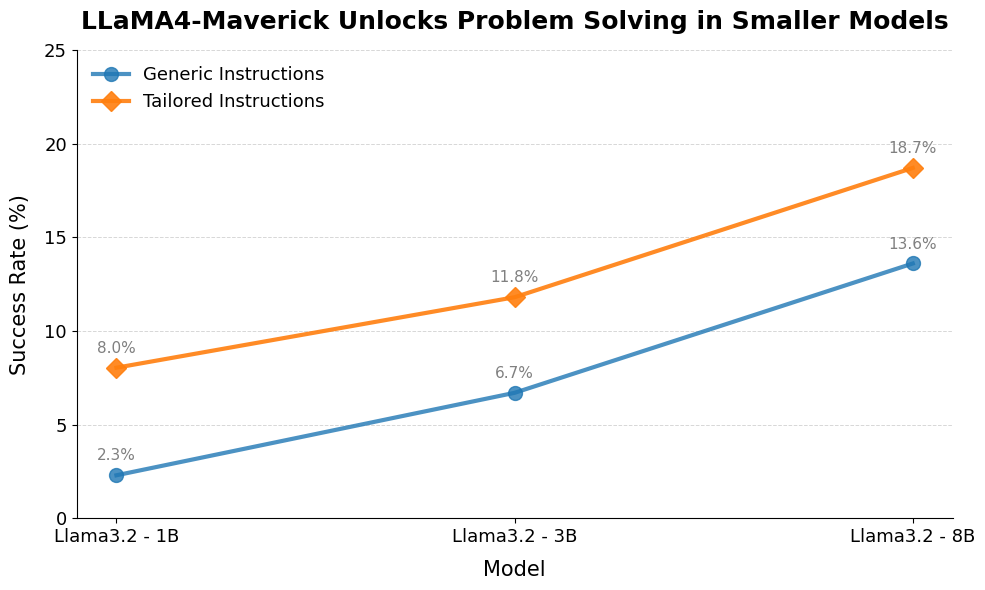

# eli5b
Explain Like I'm 5B. Improving communication between large languge models and small language models. A project done for the Stanford 8VC + Meta Llama Hackathon. 

## Motivation
Agentic systems involve multiple models interacting with each other. Often this takes the form of a large "System 2" LLM instructing a smaller, task-specific "System 1" L(S)LM. For example, many SWE agents hand off repo exploration to a small models for better efficiency; in robotics, VLA models are often small so that they can be fast for high-frequency control. 

However, models have been instruction-tuned based on instructions by humans. We hypothesize that the distribution of instructions generated by a human is not the same as the distribution for a large "System 2" LLM. On the other hand, the instructions a "System 2" LLM would give to a human are different from what should be served to a small model. 

This highlights that there is a bottleneck in the instruction-passing from a large model to a small model---a small model could achieve higher instruction-following performance if it is given instructions appropriate for it. 

## What we do
We use the new Llama 4 Maverick models (run via TogetherAI API) to give instructions to smaller Llamas---3.2 1b, 3.2 3b, 3.1 8b (deployed with Ollama). First, we give instructions using a generic prompt; then, we prompt Maverick to tailor the instructions to a small model. We evaluate on problems from the Omni-MATH datasets, prompting Maverick to give step-by-step instructions how to solve the problem (without revealing the actual solution). This allows us to identify if there is really a gap due to improper instruction generation.

## What we find
We find a notable performance gap in every model size we look at, indicating that these small models are clearly bottlenecked by the quality of instructions given by the large models.

## Take aways
This indicates an area for improvement for agentic systems---big models should be prompted to give appropriate instructions to the smaller models they are calling, while small models should be fine-tuned for better instruction-following from large models. 

